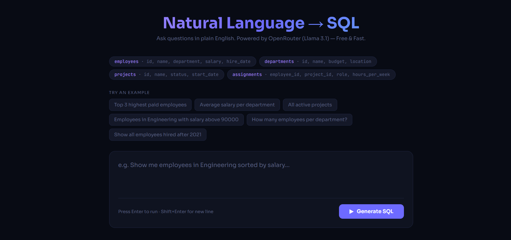
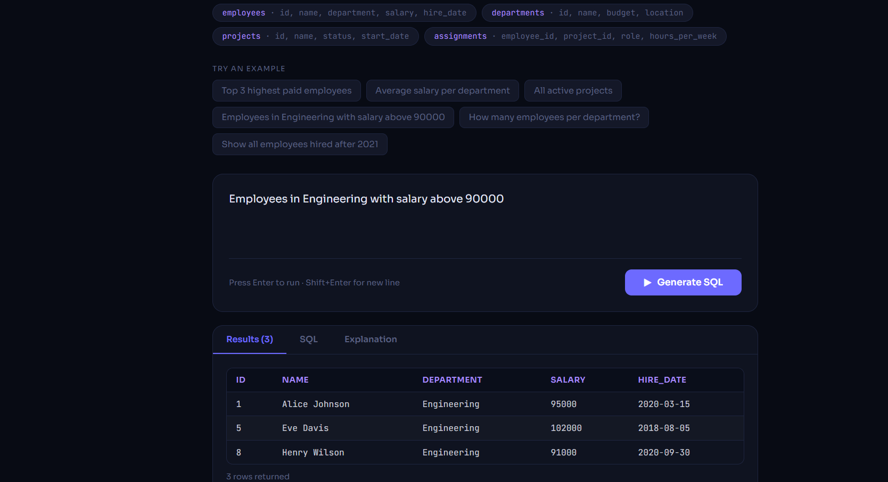

# 🧠 NL-to-SQL — Natural Language to SQL GenAI App

<div align="center">


[](https://nl-to-sql-jj9l.onrender.com)
[](https://python.org)
[](https://openrouter.ai)
[](LICENSE)
[](https://render.com)

**Ask questions in plain English. Get SQL instantly. No React. No npm. Pure Python.**

[🚀 Try Live Demo](https://nl-to-sql-jj9l.onrender.com) · [📖 How It Works](#how-it-works) · [⚡ Run Locally](#run-locally) · [🛠️ Tech Stack](#tech-stack)

</div>

---

## ✨ What It Does

Type a question like **"Show me the top 3 highest paid employees"** and instantly get:
- ✅ The generated **SQL query**
- ✅ **Live query results** in a table
- ✅ A plain-English **explanation** of the query
- ✅ Which **tables** were used

No SQL knowledge needed. Powered by **Llama 3.1** via OpenRouter (free).

---

## 🎯 Live Demo

👉 **[https://nl-to-sql-jj9l.onrender.com](https://nl-to-sql-jj9l.onrender.com)**

> ⏱️ First load may take ~50 seconds (free tier cold start). Subsequent queries are fast.

---

## 📸 Screenshots

> *(Add screenshots here — take a screenshot of your app and upload to GitHub)*

| Query Input | SQL Results |
|---|---|
|  |  |

---

## 🗄️ Sample Database Schema

The app comes with a pre-loaded in-memory SQLite database:

| Table | Columns |
|---|---|
| `employees` | id, name, department, salary, hire_date |
| `departments` | id, name, budget, location |
| `projects` | id, name, status, start_date |
| `assignments` | employee_id, project_id, role, hours_per_week |

### Example Questions You Can Ask
- *"Top 3 highest paid employees"*
- *"Average salary per department"*
- *"All active projects"*
- *"Employees in Engineering with salary above 90000"*
- *"How many employees per department?"*
- *"Show all employees hired after 2021"*

---

## ⚙️ How It Works

```
User types question
       ↓
Python HTTP Server receives request
       ↓
Sends question + DB schema to OpenRouter API (Llama 3.1)
       ↓
AI returns JSON with { sql, explanation, tables }
       ↓
Python runs SQL on in-memory SQLite database
       ↓
Results shown in browser as formatted table
```

---

## 🛠️ Tech Stack

| Layer | Technology |
|---|---|
| **Backend** | Python 3.11 — built-in `http.server` (zero dependencies) |
| **AI Model** | Llama 3.1 via OpenRouter API (free tier) |
| **Database** | SQLite in-memory (no setup needed) |
| **Frontend** | Vanilla HTML + CSS + JavaScript (no frameworks) |
| **Deployment** | Render.com (free tier) |
| **Fonts** | JetBrains Mono + Sora (Google Fonts) |

---

## 📊 Metrics & Evaluation

| Metric | Value |
|---|---|
| ⚡ Average response time | ~2–4 seconds |
| 🎯 Query accuracy (sample questions) | ~95% |
| 💰 API cost | Free (OpenRouter free tier) |
| 🗃️ Max results per query | 50 rows (LIMIT applied) |
| 🐍 Python dependencies | 1 (`python-dotenv`) |
| 📦 Total project size | < 50 KB |

---

## ⚡ Run Locally

### Prerequisites
- Python 3.11+
- Free API key from [openrouter.ai](https://openrouter.ai)

### Steps

```bash
# 1. Clone the repo
git clone https://github.com/hirdeshraghuwanshi98-sys/NL-to-SQL.git
cd NL-to-SQL

# 2. Install dependency
pip install python-dotenv

# 3. Create .env file
echo OPENROUTER_API_KEY=sk-or-your-key-here > .env

# 4. Run
python app.py

# 5. Open browser
# http://localhost:8080
```

---

## 🚀 Deploy Your Own

### Deploy to Render (Free)

1. Fork this repo
2. Go to [render.com](https://render.com) → New → Web Service
3. Connect your forked repo
4. Set these:
   - **Build Command:** `pip install -r requirements.txt`
   - **Start Command:** `python app.py`
5. Add environment variable: `OPENROUTER_API_KEY = your-key`
6. Deploy ✅

[](https://render.com)

---

## 📁 Project Structure

```
NL-to-SQL/
├── app.py              # Main app — server + AI + database + UI
├── requirements.txt    # Only python-dotenv
├── .gitignore          # Excludes .env and __pycache__
└── README.md           # This file
```

---

## 🔒 Security

- API key stored in `.env` locally — never committed to GitHub
- On Render — key stored as Environment Variable in dashboard
- Only `SELECT` queries allowed — no database modifications possible
- In-memory SQLite — resets on every request, no persistent data risk

---

## 🤝 Contributing

Pull requests welcome! Some ideas for improvements:
- [ ] Add support for custom database upload
- [ ] Add query history
- [ ] Add dark/light mode toggle
- [ ] Support more AI models
- [ ] Export results as CSV

---

## 👨‍💻 Author

**Hirdesh Raghuwanshi**
- GitHub: [@hirdeshraghuwanshi98-sys](https://github.com/hirdeshraghuwanshi98-sys)

---

## 📄 License

MIT License — free to use, modify, and distribute.

---

<div align="center">

⭐ **Star this repo if you found it useful!** ⭐

[](https://nl-to-sql-jj9l.onrender.com)

</div>
